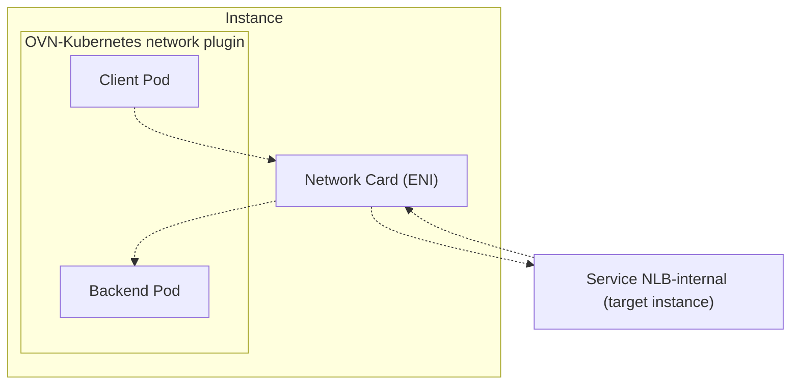

**What happened**:

Service-type LoadBalancer NLB with internal scheme are failing to expose services in hairpin scenarios: when the client is hosted in the same node as server/backend/target.



This happens in the default target type (instance) on the Service-type NLB on internal scheme (default scheme). CCM by default enables the target attribute `Preserve client IP addresses`, which would be the root cause of this problem. The proxy is also off by default, and CCM does not expose API to customize both attributes.

Service object:

```yaml
apiVersion: v1
kind: Service
metadata:
  annotations:
    aws-load-balancer-backend-protocol: http
    aws-load-balancer-ssl-ports: https
    service.beta.kubernetes.io/aws-load-balancer-internal: "true"
    service.beta.kubernetes.io/aws-load-balancer-target-node-labels: kubernetes.io/hostname=ip-10-0-4-233.ec2.internal
    service.beta.kubernetes.io/aws-load-balancer-type: nlb
  name: lbconfig-test-hp-nlb-int
  namespace: cloud-provider-aws-9871
spec:
  allocateLoadBalancerNodePorts: true
  clusterIP: 172.30.143.233
  clusterIPs:
  - 172.30.143.233
  externalTrafficPolicy: Cluster
  internalTrafficPolicy: Cluster
  ipFamilies:
  - IPv4
  ipFamilyPolicy: SingleStack
  ports:
  - name: http
    nodePort: 31419
    port: 80
    protocol: TCP
    targetPort: 8080
  type: LoadBalancer
```

**What you expected to happen**:

Hairpin connection works on service type NLB with `internal` scheme when the target type is `instance` by allowing customization of target group attributes:
- Preserve client IP addresses
- Proxy protocol v2

We need to be able to have control of both attributes so we can keep working other features like: access logs, access lists, session persistence, balancing, and anything else that depends on the source address.

**How to reproduce it (as minimally and precisely as possible)**:

1. Select a node to deploy the client and server
2. Create a backend server pod with affinity to the selected node
3. Create a Service type-LoadBalancer NLB (annotation `service.beta.kubernetes.io/aws-load-balancer-type: nlb`) with scheme internal (annotation `service.beta.kubernetes.io/aws-load-balancer-internal: "true"`)
4. Deploy a client making requests to the Load Balancer address
5. Expected the request to fail

**Anything else we need to know?**:

The network plugin is OVN Kubernetes, the overlay network have it's own CIDR (does not share with VPC CIDR), and source/dest IPs of pods leaving the nodes would be the instance primary IP address.

Introduce the annotation `service.beta.kubernetes.io/aws-load-balancer-target-group-attributes` for NLB Service resources. It accepts comma-separated `key=value` pairs for `preserve_client_ip.enabled` and `proxy_protocol_v2.enabled`, with exact lowercase `true` or `false` values. Multiple attributes may be configured together; whitespace around comma-separated entries is ignored, and when an attribute is repeated the last value is used. Empty values, unsupported attributes, other boolean spellings, and whitespace inside a value are invalid. `preserve_client_ip.enabled=false` is invalid when any Service port uses UDP or `TCP_UDP`, while `true` remains valid.

When the annotation is absent or empty, do not change existing target group attributes. When it is present, apply requested changes to every target group and avoid modifying attributes that already match the requested values.

Clusters using this feature must grant the cloud controller manager the `elasticloadbalancing:DescribeTargetGroupAttributes` and `elasticloadbalancing:ModifyTargetGroupAttributes` IAM permissions.
